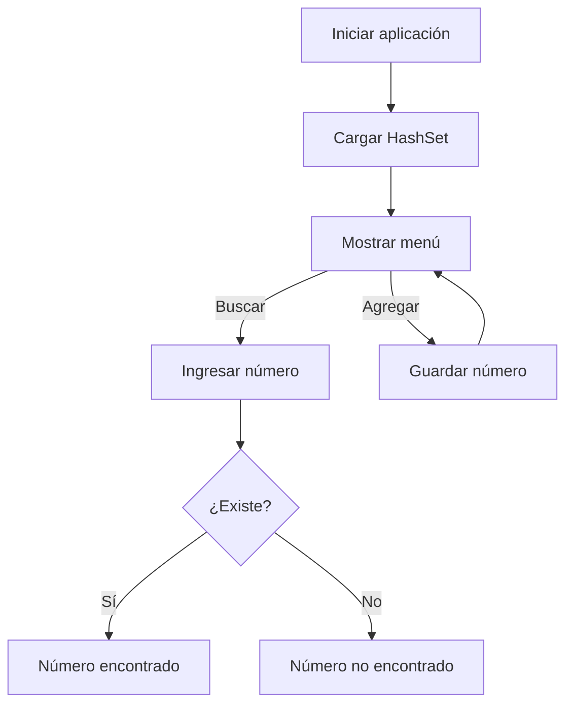

# 📱 Phone Lookup Tool

<p align="center">
  
  
  
</p>

<p align="center">
  <b>Java console application for fast phone number lookup using HashSet</b><br>
  Simple · Efficient · Clean Code
</p>

---

## 🧭 Descripción

**Phone Lookup Tool** es una aplicación de consola desarrollada en **Java** que demuestra cómo realizar **búsquedas rápidas de números de teléfono** utilizando la estructura de datos **HashSet**.

El proyecto está diseñado para mostrar buenas prácticas en el uso de colecciones y explicar por qué `HashSet` es ideal para búsquedas instantáneas.

---

## 🎯 Objetivo del proyecto

* Comprender el uso de **HashSet** en Java
* Implementar búsquedas eficientes con `.contains()`
* Crear una aplicación de consola clara y funcional
* Demostrar conceptos de **estructuras de datos**
* Versionar el proyecto con **Git y GitHub**

---

## 🧩 Tecnologías usadas

| Tecnología | Uso                  |
| ---------- | -------------------- |
| ☕ Java 11  | Lenguaje principal   |
| 🧠 HashSet | Búsqueda eficiente   |
| ⌨️ Scanner | Entrada por consola  |
| 🌱 Git     | Control de versiones |
| ☁️ GitHub  | Repositorio remoto   |

---

## 🏗️ Arquitectura del proyecto

```text
phone-lookup-tool
│
├── README.md
├── PhoneLookupTool.java
└── .gitignore
```

---

## 🔁 Flujo de funcionamiento



---

## 🧠 Componente principal

### 📄 PhoneLookupTool.java

Responsable de:

* Inicializar el `HashSet<String>`
* Mostrar el menú por consola
* Buscar números con `.contains()`
* Agregar nuevos números

```text
HashSet<String> → contains() → O(1)
```

---

## ⚡ ¿Por qué HashSet?

* No permite duplicados
* Búsqueda en **tiempo constante O(1)**
* Ideal para grandes volúmenes de datos

```java
if (phoneNumbers.contains(inputNumber)) {
    // número encontrado
}
```

---

## ▶️ Ejecución del proyecto

### Desde IntelliJ IDEA

1. Abrir el proyecto
2. Ejecutar `PhoneLookupTool.main()`

### Desde terminal

```bash
javac PhoneLookupTool.java
java PhoneLookupTool
```

---

## 🖥️ Ejemplo de uso

```text
phone lookup tool
1. search phone number
2. add phone number
3. exit
```

---

## 🧪 Buenas prácticas aplicadas

* Uso correcto de estructuras de datos
* Código limpio y legible
* Separación de lógica
* Proyecto simple pero explicable en entrevistas

---

## 🚀 Posibles mejoras futuras

* Cargar números desde archivo
* Guardar datos de forma persistente
* Validar formato de números
* Interfaz gráfica

---

## 👤 Autor

Proyecto desarrollado como práctica de **Java y estructuras de datos**.

---

<p align="center">
  <span style="color:#0A1F44"><b>Java · HashSet · Console App · GitHub</b></span>
</p>
